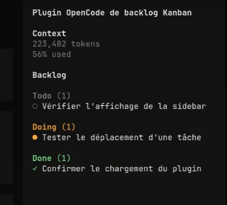

# opencode-backlog

A persistent project backlog for OpenCode V2 agents and the TUI.

`opencode-backlog` gives the agent tools to manage project tasks. It also adds an interactive backlog to the OpenCode sidebar and command palette.

Published package: [opencode-backlog on npm](https://www.npmjs.com/package/opencode-backlog).



## What It Does

The plugin stores tasks and ordered categories in `BACKLOG.json` at the project root.

New backlogs contain these categories:

- `todo`
- `doing`
- `done`

You can add, rename, style, reorder, purge, and remove categories. Each category has a stable ID and a modifiable title.

The server plugin manages tasks and categories. The TUI plugin provides:

- A live backlog summary below the sidebar context.
- A `Browse backlog` command in the command palette.
- `/backlog` and `/tasks` slash commands.
- Task details and category changes from the TUI.
- `/backlog-purge` to remove every task from a selected category.
- `/backlog-categories` to manage categories.

## Requirements

- OpenCode V2 with the beta plugin API.
- Node.js 24 and npm, or Nix with flakes enabled.

The Nix development shell supplies Node.js 24 and npm when you use Nix.

The plugin currently targets `@opencode-ai/plugin@0.0.0-beta-17927`.

## Install With Node.js

Clone the repository and build the plugin:

```sh
git clone https://github.com/sachahjkl/opencode-backlog.git
cd opencode-backlog
npm ci
npm run build
pwd
```

Add the server entrypoint to `opencode.jsonc`. Replace `/absolute/path/to/opencode-backlog` with the path printed by `pwd`.

```jsonc
{
  "$schema": "https://opencode.ai/config.json",
  "plugins": [
    "/absolute/path/to/opencode-backlog/dist/index.js"
  ]
}
```

Add the TUI entrypoint to `~/.config/opencode/cli.json`:

```json
{
  "plugins": [
    "/absolute/path/to/opencode-backlog/dist/tui.js"
  ]
}
```

Restart the OpenCode service and reopen the TUI:

```sh
opencode2 service restart
```

## Install With Nix

Build the package:

```sh
nix build github:sachahjkl/opencode-backlog
realpath result
```

The result contains two plugin entrypoints:

```text
result/lib/opencode-backlog/dist/index.js
result/lib/opencode-backlog/dist/tui.js
```

Add the server entrypoint to `opencode.jsonc`. Replace `/nix/store/...` with the path printed by `realpath result`.

```jsonc
{
  "$schema": "https://opencode.ai/config.json",
  "plugins": [
    "/nix/store/...-opencode-backlog-0.1.0/lib/opencode-backlog/dist/index.js"
  ]
}
```

Add the TUI entrypoint to `~/.config/opencode/cli.json`:

```json
{
  "plugins": [
    "/nix/store/...-opencode-backlog-0.1.0/lib/opencode-backlog/dist/tui.js"
  ]
}
```

Restart the OpenCode service after the first installation:

```sh
opencode2 service restart
```

Reopen the TUI to load the TUI plugin.

## Use The Backlog

Ask the agent to manage tasks in normal language:

```text
Add a Todo task to document the release process.
Add a Blocked category after Doing.
Move the release task to Blocked.
Purge all tasks in Done.
```

Open the command palette and select `Browse backlog` to inspect tasks. Select a task to view its ID, notes, and category.

Run `/backlog` or `/tasks` to open the same browser directly.

The backlog browser provides these shortcuts:

- `Enter` opens the selected task details.
- `n` creates a task.
- `c` changes the selected task category.
- `e` edits the selected task.
- `d` deletes the selected task after confirmation.
- `p` purges all tasks from a selected category after confirmation.

Click a sidebar task to open its details. The detail dialog provides `c`, `e`, and `d` for the same actions.

## Agent Tools

| Tool | Purpose |
| --- | --- |
| `backlog_list` | List tasks with optional `category` and `query` filters. |
| `backlog_add` | Add a task at an optional category and position. |
| `backlog_update` | Change a task title or notes. |
| `backlog_move` | Change a task category or position. |
| `backlog_remove` | Permanently remove a task. |
| `backlog_category_add` | Add a category with a stable ID, title, color, and icon. |
| `backlog_category_update` | Change a category title, color, or icon. |
| `backlog_category_move` | Change a category position. |
| `backlog_category_remove` | Remove an empty category. |
| `backlog_category_purge` | Permanently remove all tasks from a category. |

The agent receives task IDs from `backlog_list` and from each mutation result.

## Backlog File

The plugin creates `BACKLOG.json` when the first task or category is added:

```json
{
  "version": 2,
  "categories": [
    { "id": "todo", "title": "Todo", "color": "subdued", "icon": "circle" },
    { "id": "doing", "title": "Doing", "color": "warning", "icon": "dot" },
    { "id": "blocked", "title": "Blocked", "color": "error", "icon": "cross" },
    { "id": "done", "title": "Done", "color": "success", "icon": "check" }
  ],
  "items": [
    {
      "id": "c50437e3-2a57-424d-9257-32ec432145a9",
      "title": "Add invoice search",
      "notes": "Search by customer name and invoice number.",
      "status": "doing"
    }
  ]
}
```

The category array defines category order. The item array defines task order inside each category.

Category IDs stay stable when titles change. The plugin rejects tasks that reference an unknown category ID.

Category colors use theme-aware values: `default`, `subdued`, `error`, `warning`, `success`, or `info`.

Category icons use `circle`, `dot`, `check`, `cross`, `pause`, `diamond`, or `none`.

Known category IDs provide style presets when color or icon is absent:

| ID | Color | Icon |
| --- | --- | --- |
| `todo` | `subdued` | `circle` |
| `doing` | `warning` | `dot` |
| `blocked` | `error` | `cross` |
| `review` | `info` | `diamond` |
| `waiting` | `warning` | `pause` |
| `done` | `success` | `check` |
| `cancelled` | `subdued` | `cross` |

The plugin reads version 1 files with the default categories. The next backlog change writes the file as version 2.

Commit `BACKLOG.json` when the backlog must follow the project. Ignore it when the backlog must remain local.

## Verify The Installation

List active server plugins:

```sh
opencode2 api get /api/plugin
```

The response must include `opencode.backlog`.

Open the command palette in the TUI. The `Browse backlog` command confirms that the TUI entrypoint loaded.

## Development

Run all development commands through Nix:

```sh
nix develop
nix develop -c pre-commit run --all-files
nix develop -c npm run check
nix develop -c npm test
nix flake check --print-build-logs
```

Entering `nix develop` installs the repository pre-commit hook. The hook checks Nix formatting, GitHub Actions, JSON, merge conflicts, file sizes, and whitespace.

`BACKLOG.json` is not required by the test suite.

## Release

Publish each release from an authenticated workstation:

```sh
npm login
npm publish
```

Update the package version, then push its commit and tag:

```sh
npm version patch
git push origin master --follow-tags
```

Use `minor` or `major` instead of `patch` when the release requires it. Keep the tag equal to the `package.json` version.

## Compatibility

This project targets OpenCode V2. The V2 plugin API is beta and can change between OpenCode releases.

Match the plugin API version in `package.json` with the OpenCode release that loads the plugin.
